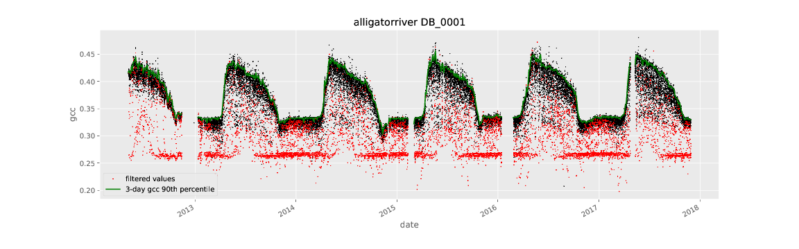

=====
Usage
=====

Command Line Scripts
--------------------

After installing the ``vegindex`` package, three python command line
scripts will be installed:

* ``generate_roi_timeseries``
* ``generate_summary_timeseries``
* ``plot_roistats``

The first script generates summary statistics for a Region of Interest
(ROI) for each image which passes certain basic selection criteria and
writes the results to a CSV file.  The second script reads in this
file and then calculates either 1-day or 3-day summary statistics for
the images in this time period.  For each time period a single line in
the CSV file is produced.  The last script will create a .pdf file
containing a plot of the ROI gcc values and the 3-day summary (90th
precentile of gcc).

Setting up the Data Directory
-----------------------------

The vegindex package is designed to work with images downloaded from
the PhenoCam network server.  To download images you can go to the
data tab at the `project website <https://phenocam.sr.unh.edu/webcam/>`_.

The images you select come in a zip file with a specific directory
structure.  For example if we download data from the ``harvard`` site.

::

   harvard
   ├── 2009
   │   ├── 01
   │   │   ├── harvard_2009_01_01_110135.jpg
   │   │   ├── harvard_2009_01_01_113135.jpg
   │   │   ├── harvard_2009_01_01_120135.jpg
    .
    .
    .

   │   └── 06
   │       ├── harvard_2009_06_01_110139.jpg
   │       ├── harvard_2009_06_01_113139.jpg
   │       ├── harvard_2009_06_01_120139.jpg
   │       └── harvard_2009_06_01_123139.jpg
   ├── harvard_meta.json
   └── harvard_meta.txt

where the we have a top level directory for ``sitename`` then
subdirectories for four-digit year and two-digit month, with
the image files in the month directories.  This is the general
structure that this package will expect the image data to be
in.

Site-Level Metadata
-------------------

The package scripts have several ways to get site-level metadata.  One
level above the site directories you can place a text file (with a
default name of ``site_info.csv``).  If this file is present the
scripts will read basic site-level metadata from this file.  Here's an
example:

::

    # This is a site info file
    sitename,lat,lon,elev,start_date,end_date,tzoffset,nimage
    test,40.00000,-60.00000,300,2008-04-04,2017-11-23,1,300
    test2,45.00000,-65.00000,1300,2008-04-04,2017-11-23,1,300

If you download images using the link above you will have this
information in the included site metadata file.  If this file is not
present the script try to use the network to get the latest version of
this information by pulling information from our server.  The pathname
of the site-level metadata file can be set using the
PHENOCAM_SITE_INFO environment variable.

ROI Lists and Masks
-------------------

Once you've selected and downloaded the data you would like to process
you will need to set up a region of interest (ROI) using an ``ROI List``
file and the associated ``ROI Mask`` images.

The ``ROI List`` file is a simple text file with
a list of ``ROI mask`` images and the dates for which the masks are
valid.  The ``ROI List`` format description can be found
on this `page <https://phenocam.sr.unh.edu/webcam/tools/roi_list_format/>`_
Here's a simple example where there is only one mask file:

::

   #
   # ROI List for harvard
   #
   # Site: harvard
   # Veg Type: DB
   # ROI ID Number: 0001
   # Owner: tmilliman
   # Creation Date: 2012-07-12
   # Creation Time: 11:42:00
   # Update Date: 2014-12-17
   # Update Time: 13:55:25
   # Description: Deciduous trees in foreground
   #
   start_date,start_time,end_date,end_time,maskfile,sample_image
   2008-04-04,00:00:00,9999-01-01,00:00:00,harvard_DB_0001_01.tif,harvard_2008_04_30_133137.jpg

If there are field-of-view shifts you may need additional lines in the
list and more mask images.  The list file and the mask images need to be
placed in a directory named ``ROI`` under the site name i.e.:

::

   harvard
   └── ROI
       ├── harvard_DB_0001_01.tif
       └── harvard_DB_0001_roi.csv

This file naming convention must also be followed.  So the ``ROI List``
has the form:

::

   <sitename>_<ROI-type>_<ROI-sequence-no>_roi.csv

and the associated masks are named according to the convention:

::

   <sitename>_<ROI-type>_<ROI-sequence-no>_<mask_index>.tif

where the "<mask_index>" in the form ``nn`` is the number in the list
of the mask file starting with 01 (e.g. 01, 02, 03, etc.).  For the
timeseries displayed on the PhenoCam Network website.  The ``ROI
List`` files and the ``ROI Mask`` images are available for download
from one of the ``ROI Pages`` on our site e.g.  `ROI page for harvard
DB_0001
<https://phenocam.sr.unh.edu/data/archive/harvard/ROI/harvard_DB_0001.html>`_

Generating the ROI Image Statistics file
----------------------------------------

The ``generate_roi_timeseries`` script reads in the ``ROI List``
file and ``ROI Mask`` images. Then for each image found within the
timeperiods in the ``ROI List`` it calculates image statistics over
the ROI.  You can get help for

::

   $ generate_roi_timeseries -h
   usage: generate_roi_timeseries [-h] [-v] [-n] site roiname

   positional arguments:
   site           PhenoCam site name
   roiname        ROI name, e.g. DB_0001

   optional arguments:
   -h, --help     show this help message and exit
   -v, --verbose  increase output verbosity
   -n, --dry-run  Process data but don't save results

The script needs to know where the site images are located.  By default
it assumes that the site level image directory is at:
::

   /data/archive/<sitename>

If the images downloaded are in another location, for example
``/mydata/directory/harvard``, you can set an an
environment variable to specify the path to the images:
::

   export PHENOCAM_ARCHIVE_DIR=/mydata/directory/

or

::

   set PHENOCAM_ARCHIVE_DIR=/mydata/directory/

Here's an example command line session:
::

   $ export PHENOCAM_ARCHIVE_DIR=~/Downloads/phenocamdata/
   $ generate_roi_timeseries harvard DB_0001
   Images processed: 594
   Images added to CSV: 594
   Total: 594

The output format for the "All Image" file can be found
`here <https://phenocam.sr.unh.edu/webcam/tools/roi_statistics_format/>`_

Generating the 1-day and 3-day Summary Files
--------------------------------------------

The ``generate_summary_timeseries`` script reads in the "All-Image"
file and calculates summary statistics for the 1-day or 3-day period:

::

   $ generate_summary_timeseries -h
   usage: generate_summary_timeseries [-h] [-v] [-n] [-p [{1,3}]] site roiname

   positional arguments:
   site                  PhenoCam site name
   roiname               ROI name, e.g. canopy_0001

   optional arguments:
   -h, --help            show this help message and exit
   -v, --verbose         increase output verbosity
   -n, --dry-run         Process data but don't save results
   -p [{1,3}], --aggregation-period [{1,3}]
                         Number of Days to Aggregate (default=1)

To generate the 3-day summary file from the "All Image" file generated
in the previous section:

::

   $ generate_summary_timeseries -p 3 harvard DB_0001
   Total: 51

A `description of the summary files <https://phenocam.sr.unh.edu/webcam/tools/summary_file_format/>`_
can be found on the project website.

Running ``plot_roistats``
-------------------------

The ``plot_roistats`` python script reads the output of
``generate_roi_timeseries`` and the 3-day summary generated by
``generate_summary_timeseries`` script.  The ``gcc`` values for individual
images are plotted as points and the three-day 90th-percentile summary
is plotted as a line.  The color of the plotted points is used to show
which data (in red) are filtered before calculating the summary
statistics.  The default filtering is shown and eliminates values
where the sun elevation angle is low (< 10 degrees) and the mean
brightness over the ROI is either low (< 100.) (very dark image)
or high ( > 665.) (washed out image).

::
   
    $ plot_roistats -h
    usage: plot_roistats [-h] [-v] site roiname
    
    positional arguments:
      site           PhenoCam site name
      roiname        ROI name, e.g. DB_0001
    
    optional arguments:
      -h, --help     show this help message and exit
      -v, --verbose  increase output verbosity

The script places the output .pdf file in the ROI directory alongside
the .csv files used to produce the plot.  

API
---

TBD
